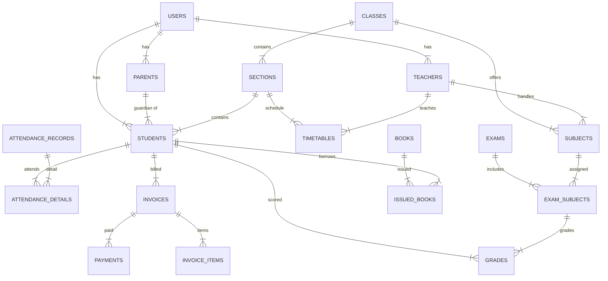
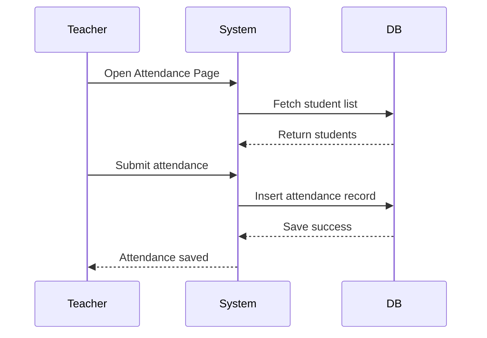

Below is **PART 2** of the School Management System (SMS) Specification.
This section includes:

✅ Full Database Schema
✅ ERD (Text + Mermaid)
✅ API Endpoints (Ultra detailed)
✅ Role Permission Matrix
✅ Data Flow Diagrams
✅ Sequence Diagrams
✅ UI Wireframe (Text-based)

All written in **clean Markdown**, compatible with ANY markdown editor.

---

# **PART 2 — Technical Specification**

---

# **1. Database Schema (Full Table List + Fields)**

Below is the **complete database schema**, grouped by module.

---

# **1.1 Users & Authentication Module**

## **Table: users**

| Field         | Type                                  | Description     |
| ------------- | ------------------------------------- | --------------- |
| id            | BIGINT PK                             | User ID         |
| name          | VARCHAR(255)                          | Full name       |
| email         | VARCHAR(255), unique                  | Login email     |
| password      | VARCHAR(255)                          | Hashed password |
| role          | ENUM(admin, teacher, student, parent) | System role     |
| profile_image | VARCHAR(255) null                     | Avatar          |
| is_active     | BOOLEAN default 1                     | Soft disable    |
| created_at    | TIMESTAMP                             |                 |
| updated_at    | TIMESTAMP                             |                 |

---

## **Table: parents**

| Field      | Type                 | Description |
| ---------- | -------------------- | ----------- |
| id         | BIGINT PK            |             |
| user_id    | BIGINT FK → users.id |             |
| phone      | VARCHAR(20)          |             |
| occupation | VARCHAR(255)         |             |
| address    | TEXT                 |             |
| created_at | TIMESTAMP            |             |
| updated_at | TIMESTAMP            |             |

---

## **Table: students**

| Field        | Type                   |
| ------------ | ---------------------- |
| id           | BIGINT PK              |
| user_id      | BIGINT FK → users.id   |
| parent_id    | BIGINT FK → parents.id |
| admission_no | VARCHAR(50)            |
| class_id     | BIGINT FK              |
| section_id   | BIGINT FK              |
| roll_no      | INT                    |
| gender       | ENUM(male, female)     |
| dob          | DATE                   |
| address      | TEXT                   |
| status       | ENUM(active, alumni)   |
| created_at   | TIMESTAMP              |
| updated_at   | TIMESTAMP              |

---

## **Table: teachers**

| Field            | Type         |
| ---------------- | ------------ |
| id               | BIGINT PK    |
| user_id          | BIGINT FK    |
| employee_code    | VARCHAR(50)  |
| phone            | VARCHAR(20)  |
| specialization   | VARCHAR(255) |
| experience_years | INT          |
| created_at       | TIMESTAMP    |
| updated_at       | TIMESTAMP    |

---

---

# **1.2 Academic Module**

## **Table: classes**

| Field         | Type             |
| ------------- | ---------------- |
| id            | BIGINT PK        |
| class_name    | VARCHAR(50)      |
| numeric_level | INT (e.g., 1–12) |
| created_at    | TIMESTAMP        |
| updated_at    | TIMESTAMP        |

---

## **Table: sections**

| Field            | Type        |
| ---------------- | ----------- |
| id               | BIGINT PK   |
| class_id         | BIGINT FK   |
| section_name     | VARCHAR(10) |
| room_number      | VARCHAR(20) |
| teacher_id | BIGINT FK   |
| capacity         | INT         |
| created_at       | TIMESTAMP   |
| updated_at       | TIMESTAMP   |

---

## **Table: subjects**

| Field        | Type            |
| ------------ | --------------- |
| id           | BIGINT PK       |
| subject_name | VARCHAR(255)    |
| subject_code | VARCHAR(50)     |
| class_id     | BIGINT FK       |
| teacher_id   | BIGINT FK       |
| max_marks    | INT default 100 |
| created_at   | TIMESTAMP       |
| updated_at   | TIMESTAMP       |

---

---

# **1.3 Timetable Module**

## **Table: timetables**

| Field       | Type                          |
| ----------- | ----------------------------- |
| id          | BIGINT PK                     |
| class_id    | BIGINT FK                     |
| section_id  | BIGINT FK                     |
| day_of_week | ENUM(mon,tue,wed,thu,fri,sat) |
| period      | INT (1–10)                    |
| subject_id  | BIGINT FK                     |
| teacher_id  | BIGINT FK                     |
| room        | VARCHAR(50)                   |
| created_at  | TIMESTAMP                     |
| updated_at  | TIMESTAMP                     |

---

---

# **1.4 Attendance Module**

## **Table: attendance_records**

| Field      | Type                    |
| ---------- | ----------------------- |
| id         | BIGINT PK               |
| class_id   | BIGINT                  |
| section_id | BIGINT                  |
| date       | DATE                    |
| marked_by  | BIGINT FK → teachers.id |
| created_at | TIMESTAMP               |

---

## **Table: attendance_details**

| Field         | Type                                 |
| ------------- | ------------------------------------ |
| id            | BIGINT PK                            |
| attendance_id | BIGINT FK                            |
| student_id    | BIGINT FK                            |
| status        | ENUM(present, absent, late, excused) |
| remark        | TEXT null                            |
| created_at    | TIMESTAMP                            |
| updated_at    | TIMESTAMP                            |

---

---

# **1.5 Examination Module**

## **Table: exams**

| Field      | Type         |
| ---------- | ------------ |
| id         | BIGINT PK    |
| exam_name  | VARCHAR(255) |
| term       | VARCHAR(50)  |
| start_date | DATE         |
| end_date   | DATE         |
| created_at | TIMESTAMP    |
| updated_at | TIMESTAMP    |

---

## **Table: exam_subjects**

| Field      | Type      |
| ---------- | --------- |
| id         | BIGINT PK |
| exam_id    | BIGINT FK |
| subject_id | BIGINT FK |
| exam_date  | DATE      |
| max_marks  | INT       |
| created_at | TIMESTAMP |

---

## **Table: grades**

| Field           | Type         |
| --------------- | ------------ |
| id              | BIGINT PK    |
| exam_subject_id | BIGINT FK    |
| student_id      | BIGINT FK    |
| marks_obtained  | DECIMAL(5,2) |
| remarks         | TEXT         |
| created_at      | TIMESTAMP    |
| updated_at      | TIMESTAMP    |

---

---

# **1.6 Fees Module**

## **Table: fee_types**

| Field      | Type                        |
| ---------- | --------------------------- |
| id         | BIGINT PK                   |
| name       | VARCHAR(255)                |
| amount     | DECIMAL(10,2)               |
| frequency  | ENUM(monthly, term, yearly) |
| created_at | TIMESTAMP                   |

---

## **Table: invoices**

| Field        | Type                        |
| ------------ | --------------------------- |
| id           | BIGINT PK                   |
| invoice_no   | VARCHAR(50) unique          |
| student_id   | BIGINT FK                   |
| total_amount | DECIMAL(10,2)               |
| due_date     | DATE                        |
| status       | ENUM(unpaid, paid, partial) |
| created_at   | TIMESTAMP                   |
| updated_at   | TIMESTAMP                   |

---

## **Table: invoice_items**

| Field       | Type          |
| ----------- | ------------- |
| id          | BIGINT PK     |
| invoice_id  | BIGINT FK     |
| fee_type_id | BIGINT FK     |
| amount      | DECIMAL(10,2) |

---

## **Table: payments**

| Field       | Type                     |
| ----------- | ------------------------ |
| id          | BIGINT PK                |
| invoice_id  | BIGINT FK                |
| amount_paid | DECIMAL(10,2)            |
| method      | ENUM(cash, bank, online) |
| paid_at     | TIMESTAMP                |
| created_at  | TIMESTAMP                |

---

---

# **1.7 Library Module**

## **Table: books**

| Field            | Type         |
| ---------------- | ------------ |
| id               | BIGINT PK    |
| title            | VARCHAR(255) |
| author           | VARCHAR(255) |
| isbn             | VARCHAR(50)  |
| category         | VARCHAR(100) |
| total_copies     | INT          |
| available_copies | INT          |
| created_at       | TIMESTAMP    |

---

## **Table: issued_books**

| Field                | Type      |
| -------------------- | --------- |
| id                   | BIGINT PK |
| book_id              | BIGINT FK |
| issued_to_student_id | BIGINT FK |
| issue_date           | DATE      |
| return_date          | DATE      |
| returned_at          | DATE null |

---

---

# **1.8 Communication Module**

## **Table: announcements**

| Field        | Type                                   |
| ------------ | -------------------------------------- |
| id           | BIGINT PK                              |
| title        | VARCHAR(255)                           |
| message      | TEXT                                   |
| target_group | ENUM(all, teachers, students, parents) |
| created_by   | BIGINT FK                              |
| created_at   | TIMESTAMP                              |

---

## **Table: messages**

| Field       | Type              |
| ----------- | ----------------- |
| id          | BIGINT PK         |
| sender_id   | BIGINT FK         |
| receiver_id | BIGINT FK         |
| body        | TEXT              |
| attachment  | VARCHAR(255) null |
| created_at  | TIMESTAMP         |

---

---

# **2. ERD (Mermaid Diagram)**



---

# **3. Role Permission Matrix**

| Module             | Super Admin | Admin   | Teacher      | Student  | Parent     |
| ------------------ | ----------- | ------- | ------------ | -------- | ---------- |
| Student Management | CRUD        | CRUD    | View         | View own | View child |
| Teacher Management | CRUD        | CRUD    | View own     | X        | X          |
| Classes & Sections | CRUD        | CRUD    | View         | View     | View       |
| Subjects           | CRUD        | CRUD    | View         | View     | View       |
| Timetable          | CRUD        | CRUD    | View own     | View     | View       |
| Attendance         | View        | View    | CRUD         | View own | View child |
| Exams              | CRUD        | CRUD    | CRUD         | View     | View       |
| Grades             | CRUD        | CRUD    | Enter grades | View     | View       |
| Fees               | CRUD        | CRUD    | View         | View own | View child |
| Library            | CRUD        | CRUD    | CRUD         | View     | View       |
| Messaging          | CRUD        | CRUD    | Send         | Send     | Send       |
| Announcements      | CRUD        | CRUD    | View         | View     | View       |
| Settings           | CRUD        | Limited | X            | X        | X          |

---

# **4. API Endpoints (REST)**

All endpoints prefixed with `/api/v1`

---

# **4.1 Auth**

### **POST /auth/login**

### **POST /auth/logout**

---

# **4.2 Students**

### **GET /students**

Filters: class_id, section_id, keyword

### **POST /students**

Body example:

```json
{
  "name": "Juan Cruz",
  "class_id": 3,
  "section_id": 2,
  "parent_id": 1
}
```

### **GET /students/{id}**

### **PUT /students/{id}**

### **DELETE /students/{id}**

---

# **4.3 Teachers**

### **GET /teachers**

### **POST /teachers**

### **PUT /teachers/{id}**

---

# **4.4 Attendance**

### **POST /attendance/mark**

Body:

```json
{
  "class_id": 1,
  "section_id": 1,
  "date": "2025-01-25",
  "entries": [
    { "student_id": 1, "status": "present" },
    { "student_id": 2, "status": "absent" }
  ]
}
```

### **GET /attendance/report**

---

# **4.5 Exams & Grades**

### **POST /exams**

### **POST /exams/{id}/subjects**

### **POST /exams/{exam_id}/grades**

### **GET /exams/{id}/report-card/{student_id}**

---

# **4.6 Fee Module**

### **POST /fees/invoice**

### **POST /fees/payment**

### **GET /fees/invoice/{id}`**

---

# **4.7 Library**

### **GET /books**

### **POST /books**

### **POST /books/issue**

---

# **5. Data Flow Diagrams (DFD)**

---

# **5.1 Level 0 (Context Diagram)**

```
[Admin] → (SMS) → Student Records  
[Teacher] → (SMS) → Attendance, Grades  
[Parent] → (SMS) → Child Records  
[Student] → (SMS) → View Timetable  
```

---

# **5.2 Level 1 DFD (Student Management)**

```
Admin → Add Student → Student Table  
Admin → Assign to Class → Class Table  
Teacher → View Students → Student Table  
Parent → View Child → Student Table → Parent Table  
```

---

# **6. Sequence Diagram Examples (Mermaid)**

---

## **6.1 Student Attendance Marking**



---

# **7. UI Wireframes (Text-Based)**

---

## **7.1 Student List Page**

```
--------------------------------------------------------
| Students                                             |
--------------------------------------------------------
| Search: [ keyword________ ] Class: [ ] Section: [ ]  |
--------------------------------------------------------
| ID | Name       | Class | Section | Parent | Actions |
--------------------------------------------------------
| 1  | Juan Cruz   | 3     | B       | Mr. Cruz | View |
--------------------------------------------------------
| Add Student | Export CSV | Promote Students          |
--------------------------------------------------------
```

---

## **7.2 Add Student Form**

```
-------------------------------------------------------
| Add New Student                                      |
-------------------------------------------------------
| First Name: [__________]                             |
| Last Name:  [__________]                             |
| Gender: ( ) Male ( ) Female                          |
| DOB: [YYYY-MM-DD]                                    |
| Class: [Select] Section: [Select]                    |
| Parent: [Select Parent]                              |
-------------------------------------------------------
| Save | Cancel                                        |
-------------------------------------------------------
```

---

# ✅ **PART 2 Completed**

If you want **PART 3**, I can generate:

✔ Full page mockups
✔ Email templates
✔ Notification flow
✔ Logging requirements
✔ Backup & failover requirements
✔ API error codes library
✔ UI component documentation
✔ Search & filtering documentation
✔ Database indexing strategy
✔ Deployment architecture

Just say: **Continue with Part 3**.
